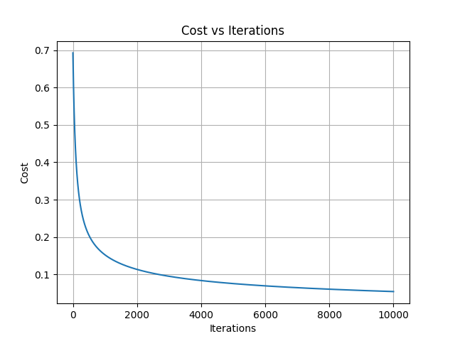
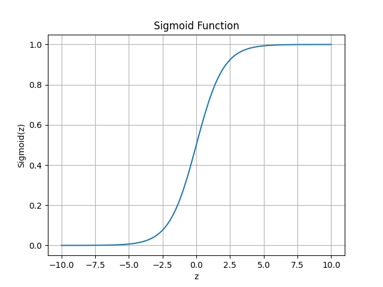

# Employee Promotion Predictor

A Machine Learning project implementing Logistic Regression from scratch using NumPy to predict whether an employee will be promoted based on performance-related factors.

---

## Project Overview

This project predicts employee promotion using:

- Years of Experience
- Performance Score
- Projects Completed

The model is built completely from scratch without using any machine learning libraries such as Scikit-Learn or TensorFlow.

---

## Features Implemented

- Logistic Regression
- Sigmoid Function
- Binary Classification
- Gradient Descent Optimization
- Z-Score Feature Scaling
- Logistic Cost Function
- Gradient Computation
- Probability-Based Prediction
- Data Visualization using Matplotlib

---

## Technologies Used

- Python
- NumPy
- Matplotlib

---

## Project Structure

```
EmployeePromotionPredictor
│
├── EmployeePromotionPredictor.py
├── README.md
├── .gitignore
└── images
    ├── cost_vs_iterations.png
    └── sigmoid_curve.png
```

---

## Learning Outcomes

Through this project, I learned:

- How Logistic Regression works mathematically
- Implementation of the Sigmoid Function
- Binary Classification using probabilities
- Feature Scaling using Z-score Normalization
- Gradient Descent for Logistic Regression
- Cost Function Optimization
- Model Training from Scratch
- Visualizing Training Progress and Decision Behavior

---

## Visualizations

### Cost vs Iterations

This graph shows how the logistic loss decreases as gradient descent updates the model parameters, indicating successful learning.



---

### Sigmoid Curve

The sigmoid function converts model outputs into probabilities between 0 and 1, enabling binary classification.



---

## Conclusion

This project demonstrates a complete implementation of Logistic Regression from scratch using NumPy. The model successfully learns patterns from employee performance data and predicts promotion outcomes using probability-based classification.
