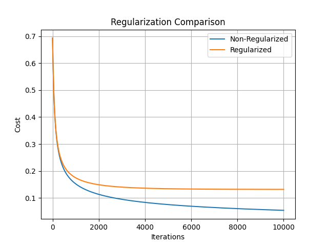
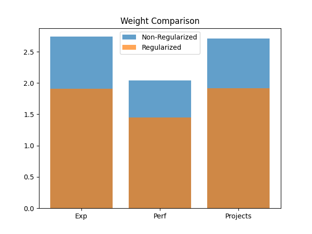

# Employee Promotion Predictor using Logistic Regression

A Machine Learning project implementing **Logistic Regression from Scratch using NumPy** to predict whether an employee will be promoted based on performance-related factors.

This project also explores **L2 Regularization**, model comparison, weight shrinkage, and probability-based classification without relying on machine learning libraries such as Scikit-Learn or TensorFlow.

---

## Project Overview

The model predicts employee promotion using:

- Years of Experience
- Performance Score
- Projects Completed

The entire learning pipeline was implemented manually, including:

- Feature Scaling
- Sigmoid Function
- Logistic Cost Function
- Gradient Computation
- Gradient Descent Optimization
- Regularization

---

## Features Implemented

### Core Logistic Regression

- Logistic Regression from Scratch
- Sigmoid Activation Function
- Binary Classification
- Probability-Based Prediction
- Z-Score Feature Scaling
- Logistic Cost Function
- Gradient Computation
- Gradient Descent Optimization

### Regularization

- L2 Regularization
- Regularized Cost Function
- Regularized Gradient Computation
- Weight Shrinkage Analysis
- Model Comparison

### Visualization

- Cost vs Iterations
- Sigmoid Curve
- Regularization Comparison
- Weight Comparison

---

## Technologies Used

- Python
- NumPy
- Matplotlib

---

## Project Structure

```text
EmployeePromotionPredictor
│
├── EmployeePromotionPredictor.py
├── EmployeePromotionPredictorRegularized.py
├── README.md
├── cost_vs_iterations.png
├── sigmoid_curve.png
├── regularization_comparison.png
└── weight_comparison.png
```

---

## Learning Outcomes

Through this project, I learned:

- Mathematical intuition behind Logistic Regression
- Binary Classification using probabilities
- Sigmoid Function implementation
- Gradient Descent optimization
- Feature Scaling using Z-score Normalization
- Cost Function minimization
- L2 Regularization
- Weight Shrinkage concepts
- Model Evaluation using Accuracy
- Visualization of training behavior

---

## Model Performance

### Training Results

| Metric | Non-Regularized | Regularized |
|----------|----------|----------|
| Final Cost | 0.0539 | 0.1317 |
| Accuracy | 100% | 100% |
| Weight Magnitude | 7.49 | 5.27 |

### Key Observation

Although both models achieved **100% training accuracy**, the regularized model produced significantly smaller weights.

This demonstrates the effect of **L2 Regularization**, which reduces model complexity and helps improve generalization by discouraging excessively large parameter values.

---

## Visualizations

### Cost vs Iterations

This graph shows how the logistic loss decreases as Gradient Descent updates the model parameters.


---

### Sigmoid Function

The sigmoid function transforms model outputs into probabilities between 0 and 1.


---

### Regularization Comparison

Comparison of training cost for regularized and non-regularized logistic regression models.



---

### Weight Comparison

This visualization demonstrates how regularization shrinks model weights and reduces complexity.



---

## Sample Prediction

### Input

```text
Years of Experience : 5
Performance Score   : 68
Projects Completed  : 5
```

### Output

```text
Prediction (Non-Regularized): Promoted
Probability: 75.26%

Prediction (Regularized): Promoted
Probability: 69.14%
```

The regularized model is less confident, illustrating how regularization discourages overconfident predictions.

---

## Future Improvements

- Train/Test Split
- Cross Validation
- Polynomial Logistic Regression
- Regularized Polynomial Logistic Regression
- Real-world Employee Dataset
- Precision, Recall and F1 Score Evaluation
- Decision Boundary Visualization

---

## Conclusion

This project demonstrates a complete implementation of **Logistic Regression from Scratch** using NumPy and extends it with **L2 Regularization**.

The results show that regularization successfully reduces weight magnitudes while maintaining perfect classification accuracy on the training data, highlighting its role in controlling model complexity and reducing the risk of overfitting.
